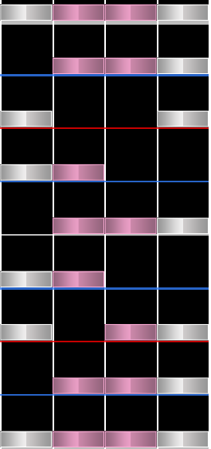

# Jack

Les **jacks** font généralement référence à 3 notes consécutives ou plus dans la même colonne. Les jacks ont généralement un snapping 1/4 ou plus et ont tendance à comporter moins de notes dans l'ensemble, ce qui les différencie des [anchors](/wiki/Beatmap/Pattern/osu!mania/Anchor). Les jacks représentent souvent des sons répétés consécutifs dans la musique.

Ils sont appelés **jacks** car le mouvement à réaliser pour les jouer imite celui d'un marteau-piqueur, dont le mot anglais est *jackhammer*.

## Minijack

Un **minijack** est un type de jack qui ne comporte que 2 notes. Il s'agit de la version la moins exigeante des jacks.

## Longjack

Un **longjack** est un type de jack plus difficile qui utilise 4 notes consécutives ou plus, généralement isolé des autres patterns. Ce terme peut également être utilisé lorsque les mêmes [jumps](/wiki/Beatmap/Pattern/osu!mania/Chord#jump) ou [hands](/wiki/Beatmap/Pattern/osu!mania/Chord#hand) sont utilisés consécutivement.

## Chordjack

Les **chordjacks** sont un mélange de [chords](/wiki/Beatmap/Pattern/osu!mania/Chord) et de différents types de jacks. Ce terme n'est généralement utilisé que pour les patterns plus denses que les [quadstreams](/wiki/Beatmap/Pattern/osu!mania/Stream#quadstream), l'utilisation plus fréquente de chords est ainsi mise en avant.

