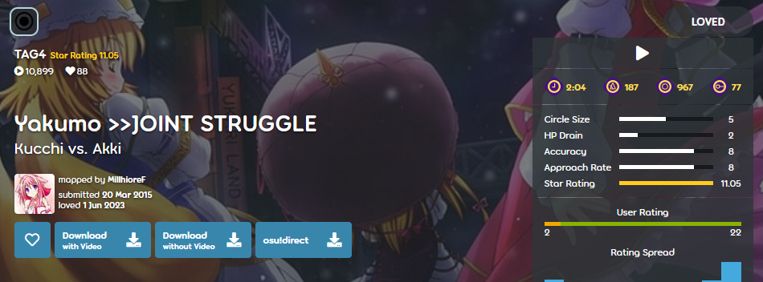

---
tags:
  - multiplayer
  - co-op
  - multijoueur
---

# Beatmaps TAG

*A ne pas confondre avec les tags, qui sont une [partie des métadonnées d'une beatmap](/wiki/Client/Beatmap_editor/Song_setup).*

**Les Beatmaps TAG** (ou simplement *TAG*) sont des beatmaps spécialement conçus pour le [mode Tag co-op ou Tag-team VS](/wiki/Client/Interface/Multiplayer#tag-co-op-/-tag-team-vs) dans les [lobby multijoueurs](/wiki/Client/Interface/Multiplayer). Ainsi, ces beatmaps nécessitent souvent un jeu coopératif entre deux joueurs ou plus dans le lobby afin d'être terminés.

Dans ces modes, chaque joueur est responsable d'une [chaîne de combo](/wiki/Beatmapping/Combo), et tout au long de la musique, les joueurs alternent entre les chaînes de combo. Pour cette raison, les beatmaps TAG sont souvent conçus de manière à ce que les chaînes de combo soient placées très loin les unes des autres, ce qui rend presque impossible le clear de la beatmap par un seul joueur.

Les [difficultés](/wiki/Beatmap/Difficulty) TAG sont le plus souvent désignées par l'utilisation du terme `TAG` dans le nom de la difficulté. Le plus souvent, ce `TAG` sera suivi d'un nombre, qui indique typiquement le nombre de joueurs pour lequel la difficulté est prévue (par exemple, `TAG2` pour deux joueurs, ou `TAG4` pour quatre joueurs).

En raison de leur nature, les difficultés TAG sont le plus souvent non classées, [approuvées](/wiki/Beatmap/Category#approved), ou [loved](/wiki/Beatmap/Category#loved). Cependant, en de rares occasions, les beatmaps TAG qui respectent les [critères de classement](/wiki/Ranking_criteria) et qui sont jugés aptes à être classés par les [Beatmap Nominators](/wiki/People/Beatmap_Nominators) peuvent se retrouver dans la section [Classée](/wiki/Beatmap/Category#ranked).
