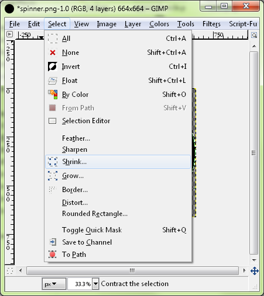

# Как сделать правильно центрированные спиннеры в скинах (перевод с английского)

[*"Как сделать спиннеры симметричными" от: ziin](https://osu.ppy.sh/community/forums/topics/51502)

Это руководство, вероятно, трудно понять для людей с небольшим опытом работы с GIMP/Photoshop. В этом руководстве предполагается, что вы знаете (и умеете) включать/выключать слои, а также находить некоторые вещи самостоятельно.

## Как сделать симметричные спиннеры

Так томительно видеть кривые спиннеры! Пожалуйста, если вы хотите сделать спиннер, убедитесь, что он идеально центрирован.

Сначала откройте свой редактор изображений, в этом руководстве будет использоваться [GIMP](https://gimp.org/), так как он бесплатный.

Создайте новый документ. Скин шаблона размером 666x666, и, хотя безопасно превысить этот предел, **спиннеры могут вызвать много задержек на медленных компьютерах, поэтому лучше всего сделать их ниже этого предела.** Сделайте документ 664x664, чтобы, когда мы закончим, мы могли залить края прозрачностью, что позволит osu! знать, что он может сглаживать границу, а не делать ее прямым краем.

### Создание нового документа

### Выберите свой круг

Используйте инструмент «Эллипс» (или горячая клавиша "e") и сделайте круг на всем документе. Создайте новый слой и заполните его цветом.

### Сжатие выделенной области

Затем уменьшите выделенную область, выбрав Выбрать - Сжать. Для более точных кругов просто перерисуйте их с помощью инструмента эллипса, так как «сжимать» хорошо только для одного или двух кругов.

Здесь выбрано 15, но вы можете выбрать столько, сколько захотите. Создайте новый слой и заполните меньшую выделенную область другим цветом, чтобы вы могли ее увидеть.

### Спиннер

Повторите этот процесс для центральной точки или любых других кругов, которые вы хотите. Я выбрал 300.

### Добавление изображения в спиннер

Затем можно использовать каждый слой для создания дизайнов или поместить на него изображение, выбрав альфа-канал этого слоя.

### Копирование изображения

И скопируйте/вставьте выделенную область из изображения, которое вы хотите скопировать:

### Установка размера холста

Наконец, вы можете добавить дизайн посередине или перекрасить края. Убедитесь, что вы сбросили размер холста до 666x666, перейдя в раздел Изображение - Размер холста, и центрируйте изображение, чтобы у вас была граница в 1 пиксель вокруг изображения.

Теперь у вас должен быть идеальный спиннер, который не колеблется, когда вы его вращаете.

В этом руководстве не будет информации о том, как сделать края красивыми или придать им глубину, это совершенно другое. Я выбрал очень простой образ и процесс. Если вы хотите это сделать, везде есть гайды, или вы, вероятно, уже знаете, как это сделать. Однако кажется, что чувство симметрии ускользнуло от большинства людей, которые делают скины.

## Как сделать спиннер фоны, которые соответствуют фону битмапа

Если вы хотите, чтобы ваш спиннер имел тот же фон, что и актуальная карта, это может быть сложно из-за ошибки в osu!, которую никогда не исправляли. Во-первых, нам нужно сопоставить фон *в игре*, а не *в редакторе битмапа*. Карта помещает элементы сториборда (фон и видео) на 5 пикселей выше на 1024x768, чем остальную часть карты.

### Не беспокойтесь, если спиннер выглядит неправильно в редакторе

### Обрезка фона

Во-первых, возьмите фон с разрешением 1024x768 и обрежьте верхние 46 пикселей и нижние 30 пикселей, получив изображение 1024x692. Изображение шаблона 1023x692, но это не имеет значения; правая сторона просто чистая черная из-за характера работы спиннеров.

### используйте вкладку каналов для отключения редактирования альфа-канала

Технически вы закончили, но если вы хотите сделать фон «заполненным» фоновым спиннер-метром, то вы можете использовать скин шаблона или сделать его самостоятельно. Откройте шаблон спиннер-метра. Чтобы перекрасить его, выключите альфа-канал, выбрав его, чтобы не трогать прозрачность вообще. Затем используйте заливку и заполните всю область серым цветом или любым другим цветом, который вы хотите (я использовал черный).

### Скопируйте/вставьте в новый слой, а затем сохраните спиннер-метр

После того, как у вас появился цвет, снова выберите весь альфа-канал (щелкните правой кнопкой мыши на альфа-канале - канал для выбора), скопируйте и вставьте фон спиннера, чтобы у вас было чем заполнить ваш спиннер-метр.

### Уменьшите непрозрачность, пока не получите цвет, который вам нравится

Чтобы добавить больше деталей, вы можете уменьшить непрозрачность на черном изображении.

### Полностью вращающийся фон спиннера и спиннер-метр

Затем вы можете увидеть, как он выглядит заполненным, включив старый слой. Обратите внимание, что у него есть немного контура. Если вы хотите изменить размер этой структуры, вы можете использовать инструмент `Выделение` — `Увеличить` или `Сжать` перед копированием / вставкой, чтобы сделать спиннер-метр.

Если вы сделаете это, переход от фона к спиннеру будет плавным, и у вас не будет фона, сдвинутого вверх на несколько пикселей.
