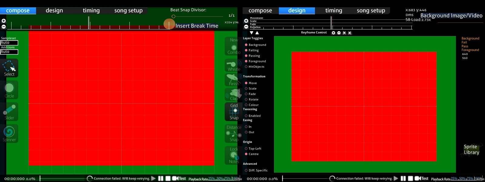

# 故事板编写一般规则

本指南会描述 .osb 或 .osu 文件中，`[Events]` 部分下的代码。谱面 .osb 文件中的命令，所有难度都会使用；而 .osu 文件中的命令只由对应难度使用。

## 基本规则

### 对象

*对于 [osu!](/wiki/Game_mode/osu!) 模式与[作图](/wiki/Beatmapping)时的物件，参见：[打击物件](/wiki/Gameplay/Hit_object)*

[故事板对象](/wiki/Storyboard/Scripting/Objects)指的是故事板中精灵图或动画的实例。故事板也可以播放声音，请阅读[音频](/wiki/Storyboard/Scripting/Audio)指南获取详情。

可以使用 PNG 与 JPEG 格式的图片作为对象。JPEG 格式是有损的，意味着文件较小，不会精确存储每个像素，也不支持透明。因此，这种格式适用于背景图片、方形图像与自然图像。PNG 格式是无损的，意味着它会保留每个像素的信息，但文件会比 JPEG 大。PNG 格式支持透明，因此通常是叠加在其他图像之上的对象或显示文本的最佳选择。

引擎会使用命令处理动态图片，因此请勿使用 PNG 格式的多图层或动态图片功能。相反地，你应该将动态图片包含的每一帧图像保存为单一文件，并且在文件的扩展名的点之前加一个数字，来让引擎按顺序播放动画（比如，对于包含两帧的动态图片 “sample.png”，可改名为 “sample0.png” 与 “sample1.png”）。

### 屏幕大小

编辑器屏幕大小为 640 x 480 像素，常规游玩区域大小为 510 x 385 像素。

坐标使用数值指定，`X` 轴正方向向**右**、`Y` 轴向**下**，原点 (0,0) 位于屏幕左上角。也可以指定这个范围外的坐标（比如让精灵图从屏幕外进入屏幕）。

**编辑器坐标：**

| 屏幕 | x | y |
| :-: | :-: | :-: |
| 编辑器 | 0–640 | 0–480 |
| 游玩区域 | 60–570 | 55–440 |

### 图层

所有故事板精灵图都位于皮肤与[打击物件](/wiki/Gameplay/Hit_object)下层。因此，即使是故事板中“最高”的层（前景层）也会显示在血条、物件与光标等等下方。

一共有四个故事板层，按优先级从低到高排序：

- 背景层
- 失败层（仅在玩家处于“失败状态”时显示，见下文的[游戏状态](#游戏状态)）
- 通过层（仅在玩家处于“通过状态”时显示，见下文的[游戏状态](#游戏状态)）
- 前景层

注意与“设计”标签页中所示不同，“失败”与“通过”层不会同时出现。

默认情况下，谱面指定的预览背景（可在[选歌界面](/wiki/Client/Interface#选歌界面)中看到的背景）置于所有四层下面。然而，如果相同的背景文件被引用为故事板中的对象，则在谱面加载后会立即消失。通常会将谱面的预览背景图指定为（时间与精灵图上）第一个对象，并使用“渐隐”（变亮）命令将背景“引进”给玩家。

#### 重叠规则

- 在**不同**层重叠的对象会按上述顺序绘制（例如，位于前景层的所有对象都会显示在其他三层上面）。
- 在**同一**图层重叠的对象会按指定的顺序绘制（例如，如果对象 1 先在 .osb 或 .osu 文件中被指定，其后是对象 2，二者处于同一图层，则对象 2 会显示在对象 1 上层）。
- .osb 文件中命令的优先级高于 .osu 文件中的命令，正如 .osb 文件的命令附加到 .osu 文件末尾一般。这不会覆盖上述提及四层的规则。[看看这个例子](https://osu.ppy.sh/community/forums/topics/1869?start=469997)。

### 游戏状态

使用故事板而非视频文件的想法，来自**动态更改元素，使之与游玩情况匹配的能力。**取决于玩家的表现状况，osu! 一次只会显示失败或通过层之一。这两个状况被称作“失败状态”与“通过状态”。

**游玩时间前**（如第一个[圆圈/滑条/转盘](/wiki/Gameplay/Hit_object)前，不一定在 MP3/OGG 音频开始播放前）的状态:

- 总处于通过状态，不会显示失败层。不推荐在这里使用通过或失败层，因为在此时认为玩家“通过”毫无意义。

**游玩期间**（“掉血时间”，玩家需要点击物件，防止血量下降）的状态:

- 当处于第一个颜色连击，或前一个连击末尾获得“激”（或“精英节拍！”（EBA 中的判定，连击中全部获得 300））时，处于通过状态。
- 除了以上的情况之外，均为失败状态。注意与 DS 游戏（有三个状态）不同，“喝”（或“击中！”（EBA 中的判定））判定没有对应的状态。
  - 在 [osu!taiko](/wiki/Game_mode/osu!taiko) 中，玩家最后一个物件得 MISS 时为失败状态，否则为通过状态。
  - 在 [osu!catch](/wiki/Game_mode/osu!catch) 中，总会使用前一休息时段的状态。首个可玩区段期间总处于通过状态。

**休息时段**（游玩时段之间）的状态：

- 当上一游玩时段结束时血条过半，则为通过状态（即出现“O”符号）。
- 否则为失败状态（即出现“X”符号）。
  - 在 [osu!taiko](/wiki/Game_mode/osu!taiko) 中，在一定时间点达到一定限额时。参考以下两个例子：
    - 示例一：血条仍处于 40% 时准确率为 96.5% 可获得“通过”而非“失败”。
    - 示例二：在大约 30 个物件中得到太多 100，以及血条仍约处于 30% 时获得 D 评价，会导致“失败”（此情况参见[ZUN - Maiden's Cappricio ~ Dream Battle](https://osu.ppy.sh/beatmapsets/18005#taiko/69556)）。

若谱面至少有一个休息时段，在上一游玩时间后的状态：

- 若至少一半休息时段处于通过状态，则是通过状态。
- 否则为失败状态。

若谱面没有休息时段，在上一游玩时间后的状态：

- 与休息时段期间相同。

### 时间

- 时间从谱面主要音频文件 (`.mp3`/`.ogg`) 起始处开始，以毫秒为单位（1000 毫秒 = 1 秒），也可以用负值表示片头。
- 故事板的时间与谱面本身的计时设置（如小节数、每分钟拍数）无关。因此，推荐你在制作故事板前就将谱面的时间轴测好，因为这些设置日后会更难调整。
- 时间不受歌曲长度限制。歌曲开始前（片头）事件的时间可以使用负值，事件也可以使用游玩部分与音频文件结束后的时间（片尾）。
- 当被加载后，谱面会从指定的最早事件与时间 0 中，较早的时间点开始。
  - 在前一种情况下，会向用户显示`跳过`按钮。点击按钮或按下`空格`后会跳转到时间 0，此时游戏转而使用正常的谱面前跳转行为（例如再点一次`跳过`会直接跳转到倒计时 - 与[《精英节拍特工》](https://zh.wikipedia.org/wiki/%E7%B2%BE%E8%8B%B1%E8%8A%82%E6%8B%8D%E7%89%B9%E5%B7%A5)中不同，后者在重玩谱面时会将玩家带回最起点，而不是时间 0）。
- 在最后一个事件发生后，或用户点击`跳过`按钮或按下`空格`键时，游戏会转场到[结算界面](/wiki/Client/Interface#结算界面)。
  - 通过与失败层的事件**都**包含在内，无论会显示哪一个。
    - 例如：失败层故事板在时间 20000 处结束，通过层在 25000 处结束，则即使玩家处于失败状态（所有对象消失了），游戏也会等待到时间 25000。因此，最好的办法是确保两层故事板结束的时间都相同。
  - 用户提前跳转到结算界面时，事件依然会继续进行，也可以听到故事板播放的声音。
- 当使用谱面编辑器的“设计”标签页时，会以毫秒为单位显示当前时间。按下 `Ctrl` + `C` 可将时间复制到剪贴板。

## 注释

可以添加 C 语言样式的单行注释，但请注意，当在游戏内编辑器保存谱面时，注释可能会被移除。默认情况下，有几条注释会建议你将命令按四层分开写。

`// 这是一条注释。`

与 C/C++/C#/Java 中的注释不同，注释不能与有效命令放在同一行。也无法在脚本中使用块注释。
