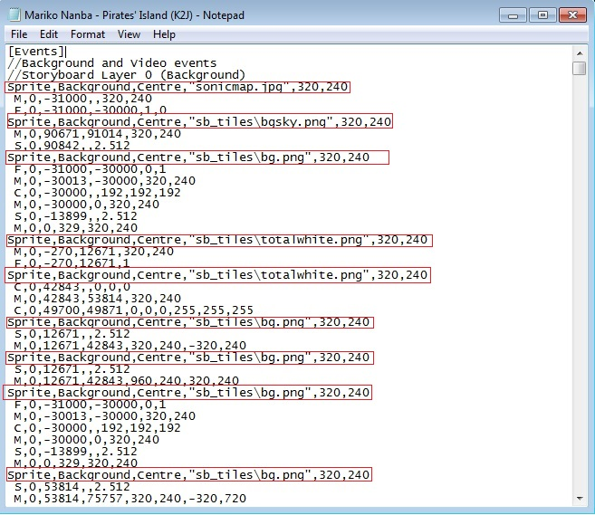

# Storyboard-Objekte

*Für Objekte in [osu!](/wiki/Game_mode/osu!) und beim [Beatmapping](/wiki/Beatmapping), siehe: [Hit-Objekte](/wiki/Gameplay/Hit_object)*

Beim [Storyboarding](/wiki/Storyboard) sind **Objekte** Sprites oder Animationen, die auf dem Bildschirm erscheinen und das Storyboard bilden. Instanzen zu SB-spezifischen Audioeffekten können genauso als Objekte bezeichnet werden, jedoch gibt es zur Klarstellung [hier](/wiki/Storyboard/Scripting/Audio) noch einen eigenen Artikel dazu.

## Definition von Objekten

Benutze eine einzelne Zeile im Abschnitt `[Events]` einer .osb oder .osu Datei, um eine Instanz eines Sprites (ein Standbild) oder einer Animation aufzurufen.

| Standbild | Animierte Bilder |
| :-- | :-- |
| Sprite,(Ebene),(Ursprung),"(Dateipfad)",(x),(y) | Animation,(Ebene),(Ursprung),"(Dateipfad)",(x),(y),(frameAnzahl),(frameVerzögerung),(Wiederholung) |

Wobei:

- **(Ebene)** die **[Schicht](/wiki/Storyboard/Scripting/General_Rules) ist, auf denen die Objekte erscheinen.** Die erlaubten Werte werden unten aufgelistet.
- **(Ursprung)** angibt, wo **auf dem Bild osu! den Ursprung des Bildes (Koordinaten) setzen soll.** Dies beeinflusst die Werte (x) und (y) sowie verschiedene andere befehlsspezifische Verhaltensweisen. Beispielsweise bestimmen die Werte (x) und (y) bei (Ursprung) = TopLeft, wo die linke obere Ecke des Bildes auf dem Bildschirm sein soll. Die erlaubten Werte werden unten aufgelistet.
- **(Dateipfad)** der **Dateiname des Bildes ist, das du aufrufen möchtest.** Es ist aber nicht immer ganz so einfach:
  - Wenn du Unterordner im Songordner verwendest, musst du den Pfad miteinbeziehen.
    - Beispiel: "Hintergründe/himmel.jpg", wenn dein Unterordner "Hintergründe" und das darin beinhaltete Bild "himmel.jpg" heißt. Der Dateipfad fängt erst im Songordner an, also dort wo die .osb- und .osu-Dateien sind (also ein relativer Dateipfad). So etwas wie "C:" ist nicht gültig.
  - Animationen werden ohne Zahlen referenziert. Wenn du zum Beispiel "sample0.png" und "sample1.png" für eine Animation bestehend aus zwei Frames verwenden möchtest, musst du auf "sample.png" verweisen.
  - Die Anführungsstriche (`"`) sind technisch optional, sie werden jedoch bei Dateinamen und Unterordnern benötigt, wenn Leerzeichen darin enthalten sind.
    - Beispiel: "SB/J\_K.jpg" und nicht SB/J\_K.jpg. Bei letzterem sucht osu! nach SB/J (eine ungültige Variable).
- **(x)** und **(y)** die **x-/y-Koordinaten sind, an denen das Objekt standardmäßig sein soll.** Die Interpretation hängt vom Wert des (Ursprungs) ab. Gültige Werte für Instanzen, um ein 640 x 480 Bild als Hintergrund zu setzen, wären:
  - Ursprung = TopLeft, x = 0, y = 0
  - Ursprung = Centre, x = 320, y = 240
  - Ursprung = BottomRight, x = 640, y = 480
    *und so weiter.*

Ebenen haben diese Werte:

| Wert | Ebene |
| :-: | :-- |
| 0 | Background |
| 1 | Fail |
| 2 | Pass |
| 3 | Foreground |

Gültige Werte für Ursprünge lauten:

| Wert | Ursprung |
| :-: | :-- |
| 0 | TopLeft |
| 1 | Centre |
| 2 | CentreLeft |
| 3 | TopRight |
| 4 | BottomCentre |
| 5 | TopCentre |
| 6 | Custom (der gleiche Effekt wie bei TopLeft, sollte aber nicht verwendet werden) |
| 7 | CentreRight |
| 8 | BottomLeft |
| 9 | BottomRight |

**Speziell nur für Animationen:**

- **(frameAnzahl)** zeigt an, **wie viele Frames die Animation hat.** Wenn du zum Beispiel "sample0.png" und "sample1.png" für eine Animation mit 2 Frames verwendest, dann gilt `frameAnzahl = 2`.
- **(frameVerzögerung)** zeigt an, **wie viele Millisekunden zwischen jedem Frame liegen.** Wenn zum Beispiel die Animation mit 2 Frames pro Sekunde abgespielt werden soll, dann gilt `frameVerzögerung = 500`.
- **(Wiederholung)** zeigt an, ob sich **die Animation wiederholen soll oder nicht**. Gültige Werte sind:
  - LoopForever (Standardwert, wenn kein Wert angegeben ist. Die Animation fängt nach dem letzten Frame wieder von vorne an.)
  - LoopOnce (Die Animation endet nach dem letzten Frame und zeigt den letzten Frame weiter an. Nützlich für Animationen, bei denen sich beispielsweise jemand herumdreht.)

Beachte, dass *es keinen Hinweis dazu gibt, wann das Objekt angezeigt werden soll*. Das kommt ganz auf [die Befehle selbst](/wiki/Storyboard/Scripting/Commands) an. Die Reihenfolge der Objektdeklarationen in der .osu- oder .osb-Datei betrifft nur die Überlappung der Elemente. Sie hat keinen Einfluss darauf, wann das Objekt angezeigt wird (generell ist es üblich, die Deklarationen in der Reihenfolge zu halten, in der sie erscheinen sollen).

## Beispiele

| Standbild | Animierte Bilder |
| :-- | :-- |
| Sprite,(Ebene),(Ursprung),"(Dateipfad)",(x),(y) | Animation,(Ebene),(Ursprung),"(Dateipfad)",(x),(y),(frameAnzahl),(frameVerzögerung),(Wiederholung) |

Einige Beispiele, wie Objekte deklariert werden:

`Sprite,Pass,Centre,"Text\Play2-HaveFunH.png",320,240`

Dadurch wird ein Bild (Sprite) deklariert, was sich auf die Datei "Play2-HaveFunH.png" bezieht, welches sich im Unterorder "text" befindet. Das Bild erscheint mittig bei (320,240) in der Pass-Ebene auf dem Bildschirm.

`Animation,Fail,BottomCentre,"Sonstiges\Play3\explosion.png",418,108,12,31,LoopForever`

Dies deklariert eine Animation, dessen Frames als "explosion0.png", "explosion1.png", ..., "explosion11.png" im Ordner "Play3" in dem Unterordner "Sonstiges" zu finden sind. Die untere Mitte des Bildes erscheint bei (418,108) in der Fail-Ebene auf dem Bildschirm. Die Animation besteht aus 12 Frames (deshalb wird der letzte Frame auch "explosion11.png" genannt) und die Frames wechseln alle 31 Millisekunden (31 \* 12 = 372 Millisekunden für eine komplette Animation). Nachdem der letzte Frame für 31 Millisekunden angezeigt wurde, fängt die Animation wieder von vorne an und zwar solange, bis das Objekt entfernt wird.
